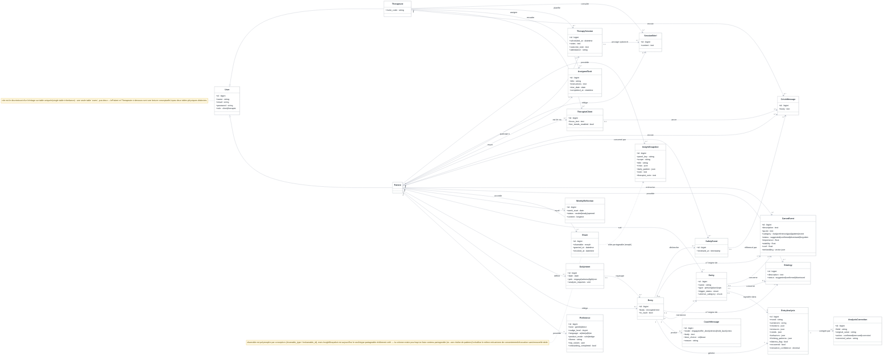

# Class diagram

The main models and how they relate. GitHub renders the diagram below; elsewhere, paste the code block into [mermaid.live](https://mermaid.live).

```mermaid
%%{init: {'theme':'base', 'themeVariables': {
  'primaryColor':'#ffffff',
  'primaryTextColor':'#1f2933',
  'primaryBorderColor':'#c7ccd1',
  'lineColor':'#8a94a6',
  'secondaryColor':'#f5f7fa',
  'tertiaryColor':'#eef1f5',
  'noteBkgColor':'#fff8e1',
  'noteTextColor':'#5c4b00',
  'noteBorderColor':'#e6d38a',
  'fontFamily':'Inter, system-ui, sans-serif'
}}}%%
classDiagram
    direction LR
    %% ============ CORE ACCOUNT & SETTINGS ============
    %% Patient/Therapeute are shown as a generalization because `role` is a
    %% permanent, exclusive trait of the account (never both) — the correct
    %% UML relation for that is inheritance, not two same-class associations
    %% distinguished only by a label. Physically this is single-table
    %% inheritance: ONE `users` table with a `role` enum discriminator, not
    %% two separate tables — noted below rather than modelled as two tables,
    %% to stay honest about the real schema while keeping the class diagram
    %% conceptually correct.
    class User {
        +id : bigint
        +name : string
        +email : string
        +password : string
        +role : client|therapist
    }
    class Patient {
    }
    class Therapeute {
        +invite_code : string
    }
    User <|-- Patient
    User <|-- Therapeute
    note for User "role est le discriminant d'un héritage sur table unique\n(single table inheritance) : une seule table `users`, pas deux —\nPatient et Therapeute ci-dessous sont une lecture conceptuelle,\npas deux tables physiques distinctes."

    class Preference {
        +id : bigint
        +tone : gentle|direct
        +nudge_level : tinyint
        +language : ar|darija|fr|en
        +product_mode : solo|bridge
        +theme : string
        +top_values : json
        +onboarding_completed : bool
    }
    %% ============ JOURNALING & ANALYSIS ============
    class Entry {
        +id : bigint
        +body : encrypted text
        +in_vault : bool
    }
    class DailyIntent {
        +id : bigint
        +date : date
        +pick : engage|witness|light|rest
        +analysis_requests : uint
    }
    class EntryAnalysis {
        +id : bigint
        +mood : string
        +sentiment : string
        +emotions : json
        +stressors : json
        +needs : json
        +behaviors : json
        +thinking_patterns : json
        +distress_flag : bool
        +recovered : bool
        +extraction_confidence : decimal
    }
    class CoachMessage {
        +id : bigint
        +mode : engage|offer_door|witness|hold_back|crisis
        +body : text
        +door_choice : sit|leave
        +reason : string
    }
    class WeeklyReflection {
        +id : bigint
        +week_start : date
        +status : sealed|ready|opened
        +content : longtext
    }
    class Strategy {
        +id : bigint
        +description : text
        +status : suggested|confirmed|dismissed
    }
    class Entity {
        +id : bigint
        +name : string
        +type : person|place|topic
        +trigger_status : enum
        +valence_category : enum
    }
    %% ============ MEMORY & CORRECTIONS ============
    class AnalysisCorrection {
        +id : bigint
        +field : string
        +original_value : string
        +action : confirmed|removed|corrected
        +corrected_value : string
    }
    class CanonEvent {
        +id : bigint
        +description : text
        +quote : text
        +category : fact|preference|goal|pattern|event
        +status : suggested|confirmed|dismissed|forgotten
        +importance : float
        +stability : float
        +conf : float
        +embedding : vector json
    }
    %% ============ SAFETY ============
    class SafetyEvent {
        +id : bigint
        +reviewed_at : timestamp
    }
    class CrisisMessage {
        +id : bigint
        +body : text
    }
    %% ============ THERAPIST <-> CLIENT BRIDGE ============
    class TherapistClient {
        +id : bigint
        +focus_text : text
        +live_trends_enabled : bool
    }
    class TherapySession {
        +id : bigint
        +scheduled_at : datetime
        +notes : text
        +outcome_note : text
        +attendance : string
    }
    class SessionBrief {
        +id : bigint
        +content : text
    }
    class AssignedTask {
        +id : bigint
        +title : string
        +instructions : text
        +due_date : date
        +completed_at : datetime
    }
    class InsightSnapshot {
        +id : bigint
        +panel_key : string
        +scope : string
        +title : string
        +rows : json
        +daily_pattern : json
        +note : text
        +therapist_note : text
    }
    class Share {
        +id : bigint
        +shareable : morph
        +granted_at : datetime
        +revoked_at : datetime
    }

    %% ============ RELATIONS ============
    %% compte & préférences — Preference, le journaling et tout ce qui en
    %% découle sont réservés au rôle patient/client dans l'application réelle
    %% ("un compte thérapeute ne reçoit volontairement aucune ligne de
    %% préférences", voir §4.2 du rapport) : rattachés à Patient, pas à User.
    %% La règle est appliquée au niveau applicatif, pas par une contrainte de
    %% base de données (la colonne user_id, elle, référence bien `users`).
    Patient "1" --> "1" Preference : possède
    Patient "1" --> "0..*" Entry : rédige
    Patient "1" --> "0..*" DailyIntent : définit
    Patient "1" --> "0..*" Entity : suit
    Patient "1" --> "0..*" WeeklyReflection : reçoit
    Patient "1" --> "0..*" Share : accorde
    Patient "1" --> "0..*" Strategy : possède
    Patient "1" --> "0..*" CanonEvent : mémorise
    Patient "1" --> "0..*" SafetyEvent : concerné par
    Patient "1" --> "0..*" CrisisMessage : envoie
    Therapeute "1" --> "0..*" CrisisMessage : envoie

    %% pont thérapeute — TherapistClient est le pivot du lien d'invitation
    %% (+ focus_text/live_trends), désormais entre Therapeute et Patient
    %% directement plutôt que deux arêtes ambiguës depuis un même User.
    %% AssignedTask, TherapySession, SessionBrief et InsightSnapshot portent
    %% chacun leurs PROPRES clés étrangères directes therapist_id/client_id
    %% vers `users` — aucun d'eux n'a de clé étrangère vers therapist_client ;
    %% seul CrisisMessage en a une.
    Therapeute "1" --> "0..*" TherapistClient : encadre
    Patient "1" --> "0..*" TherapistClient : est lié via
    TherapistClient "0..1" --> "0..*" CrisisMessage : ancre
    Therapeute "1" --> "0..*" AssignedTask : assigne
    Patient "1" --> "0..*" AssignedTask : reçoit
    Therapeute "1" --> "0..*" TherapySession : planifie
    Patient "1" --> "0..*" TherapySession : participe à
    Therapeute "1" --> "0..*" SessionBrief : consulte
    Patient "1" --> "0..*" SessionBrief : rédige
    Patient "1" --> "0..*" InsightSnapshot : possède
    TherapySession "0..1" --> "0..*" SessionBrief : ancrage optionnel

    %% boucle journaling & analyse
    DailyIntent "0..1" --> "0..*" Entry : regroupe
    Entry "1" --> "1" EntryAnalysis : génère
    Entry "1" --> "0..*" CoachMessage : produit
    Entry "0..*" --> "0..*" Entity : mentionne
    Entity "0..1" --> "0..*" EntryAnalysis : signalée dans
    Entity "0..1" --> "0..*" Strategy : concerne
    Entry "0..1" --> "0..*" Strategy : à l'origine de
    Entity "0..1" --> "0..*" CanonEvent : concerne
    Entry "0..1" --> "0..*" CanonEvent : à l'origine de
    EntryAnalysis "1" --> "0..*" AnalysisCorrection : corrigée par

    %% sécurité
    Entry "1" --> "0..*" SafetyEvent : déclenche
    SafetyEvent "0..1" --> "0..*" CrisisMessage : référencé par

    %% partage polymorphe
    Share ..> InsightSnapshot : cible partageable (morph)
    note for Share "shareable est polymorphe par conception (shareable_type +\nshareable_id), mais InsightSnapshot est aujourd'hui le seul\ntype partageable réellement créé — la colonne existe pour\nqu'un futur contenu partageable (ex. une chaîne de patterns)\nréutilise le même mécanisme de consentement/révocation sans\nnouvelle table."

```
